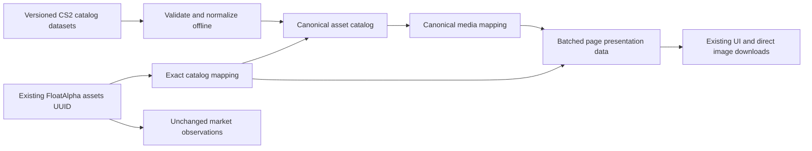

# Canonical catalog V1

FloatAlpha controls its normalized catalog schema, synchronization implementation, identity reconciliation, manifests, hashes and presentation mappings. Third-party CS2 item artwork retains its source provenance and rights; it is not described as FloatAlpha-owned artwork.

Identity, catalog metadata, and observations are separate. No `assets` UUID or observation foreign key is changed. Market providers are not catalog authorities. The application obtains existing market data through its original queries, then uses one batched query against catalog mappings for the entire result set. React's existing request cache shares the resulting snapshot across server components. No N+1 media lookups occur.

## Storage

The additive, checksummed migration is `db/catalog/001_catalog.sql`, following the repository's dedicated-subsystem SQL migration convention. `npm run db:migrate:catalog` requires explicit `CATALOG_DATABASE_URL` and never falls back to the collector connection.

- `canonical_asset_catalog`: stable catalog ID, exact nullable market name, asset type, display name, type-specific metadata JSONB, provider/dataset/source ID, normalizer version, raw-source hash, source revision, nullable source update time, synchronization time, and conservative disappearance marker.
- `asset_media`: canonical catalog reference, media type, source/served URLs, state, dimensions, MIME type, raw-byte SHA-256, alpha bounds, verification timestamp and diagnostic.
- `asset_catalog_mappings`: unchanged FloatAlpha asset UUID and exact name, match state, nullable canonical ID, explicit candidate IDs and reason.
- `catalog_sync_runs`: operational manifest/run history. Repeated runs may append operational history without altering logical catalog state.
- `catalog_schema_migrations`: applied migration checksum and time.

Weapon, pattern, paint index, wear, float bounds, rarity and actual variant booleans are typed nullable fields in metadata JSONB. Source IDs, base skin ID, weapon identifiers and source model/style references are retained for future research. Container contents are not copied into each normalized row; the record hash and pinned source retain provenance. Source HTML descriptions are not rendered.

The catalog can live in its own database, including isolated local development. Mapping UUIDs are external references to the authoritative `assets` table; runtime verifies both UUID and exact name. Catalog/media foreign keys are enforced locally. No cross-database foreign key or mutation of market identity is attempted.

## Runtime and failure isolation

`marketSnapshot()` adds `catalog` presentation data after its existing market calculations. Existing image components receive media URLs with initial page data. When there is no exact mapping or usable URL, they render text-only from the outset. Image load errors retain a reserved well and hide the broken element. The same media contract supports a later controlled CDN URL.

Health remains configuration AND a cached HEALTHY decision. Only explicit trimmed, case-insensitive `false` disables configuration. Missing/expired health fails closed. The original two rounds of five probes, with four required successes per round, remain unchanged. Probe URLs are stable delivery sentinels independent of catalog name matching. Provider health never depends on catalog coverage or an individual image miss.

The legacy `/api/asset-images/[name]` route and 100-name JSON map remain for compatibility and their regression tests. Normal product pages no longer use them. They can be removed after deployed clients/bookmarks no longer depend on the route; retain the delivery sentinel URLs and circuit breaker independently.

Missing catalog configuration or database availability yields text-only pages, without failing market data or falling back to runtime discovery. Production therefore needs migration and catalog bootstrap before enabling this deployment's media. No production rollout was performed.
